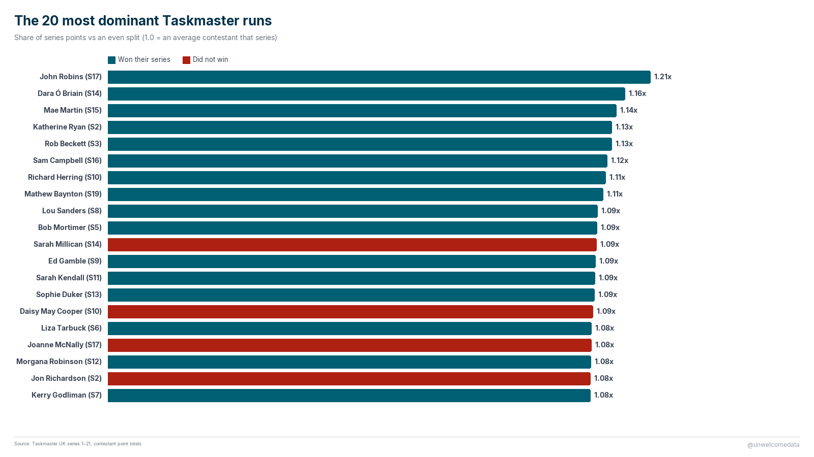
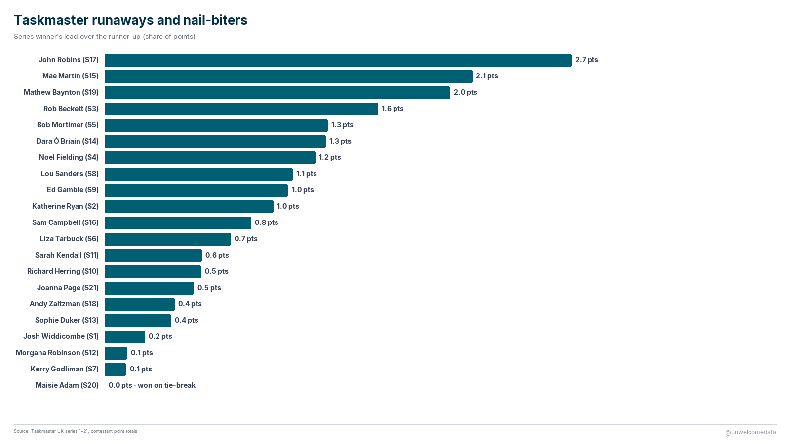

# Taskmaster: who really dominated?

A cross-series comparison of every contestant on *Taskmaster* (UK), series 1–21 —
105 contestants in all.

The catch: series aren't the same length (6, 5, 8, or 10 episodes), so raw point
totals **can't** be compared directly — a contestant in a 10-episode series has far
more points on the table than the winner of a 5-episode series. So instead of raw
points, every contestant is scored by their **share of their own series' points**,
which puts all 21 series on one common scale.

**The finding:** four contestants posted top-20 all-time runs and *still didn't win
their series* — they just happened to land in a stacked cast. Sarah Millican's
runner-up run in Series 14 out-scored 11 of the 21 actual series champions.

---

## The charts

**The 20 most dominant runs** — teal = won their series, red = didn't. Four red bars
crack the all-time top 20.

**Runaways and nail-biters** — every winner's margin over the runner-up. John Robins
(S17) ran away with it; three series came down to a single point.

---

## How it was measured

The key metric is **share of series points relative to an even split**
(`share_vs_equal` in the data):

- Each contestant's points ÷ their series' total points = their share of that series.
- Divided by an even five-way split, so **1.0 = an exactly average contestant that
  series**, above 1.0 = above average, below = below.

This normalizes for the differing series lengths that make raw totals misleading.

**Honest limit:** share-of-series still isn't perfectly equal across series — task
counts and points-per-task vary a bit from series to series. It's far closer to
apples-to-apples than raw totals, but *Taskmaster* points are a subjective, comedic
score awarded on-air, not an objective performance measure. Treat this as "who
dominated their own series," not a definitive skill ranking.

---

## The data

The full dataset is in [`export/`](export/):

- `taskmaster_contestant_metrics_v1.csv` / `.xlsx` / `.parquet` — 105 contestants ×
  12 columns (raw totals, series share, normalized score, within-series rank, winner
  flag, margin to winner).
- `taskmaster_contestant_metrics_v1_codebook.md` — plain-English description of every
  column.

*(If the `export/` files aren't present in your copy, they regenerate from the
pipeline — see the source notes below.)*

---

## Sources & license

Full attribution is in [SOURCES.md](SOURCES.md). In short:

- **Points:** hand-collected from the *Taskmaster* UK on-air scoreboards (series
  finales), cross-checked against the Taskmaster Fandom per-episode statistics and
  Digital Spy. Scores are facts and aren't copyrightable; the compiled dataset is
  released by the author.
- **Names:** contestant full names verified against the show's broadcast credits.

Two documented data decisions: an OCR digit misread was corrected (S10 Katherine
Parkinson, 148 → 118), and the Series 20 three-way tie — which Maisie Adam won on a
live tie-break — is recorded so Adam is the sole winner. Both are explained in
SOURCES.md.

License: dataset released as facts (not copyrightable); see SOURCES.md for details.

---

## A few things that stood out

- **John Robins (S17)** is the most dominant run in the show's history (1.21× an
  average contestant), and also the biggest runaway win — 21 points clear of the
  runner-up.
- **Series 20** was the tightest finish ever: a genuine three-way tie at 151 points,
  settled by a live tie-breaker.
- Four beloved runners-up — **Sarah Millican (S14), Daisy May Cooper (S10), Joanne
  McNally (S17), Jon Richardson (S2)** — had top-20 all-time runs without winning.

---

> **AI-Assisted Development**
> This project was built with the assistance of [Kiro](https://kiro.dev), an
> AI-powered development environment. All data-sourcing decisions, methodology
> choices, and published findings are the responsibility of the author. AI was used
> for code generation, data-pipeline construction, and research assistance — not for
> analysis conclusions or editorial judgment.
